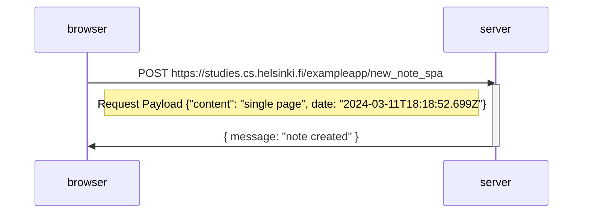

```mermaid

sequenceDiagram
    participant browser
    participant server

    browser->>server: POST https://studies.cs.helsinki.fi/exampleapp/new_note_spa
    activate server

    Note left of server: Request Payload {"content": "single page", date: "2024-03-11T18:18:52.699Z"}

    server->>browser: { message: "note created" }
    deactivate server
```
